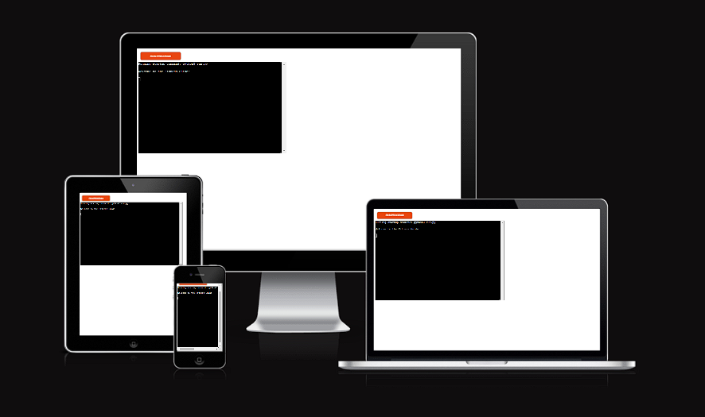
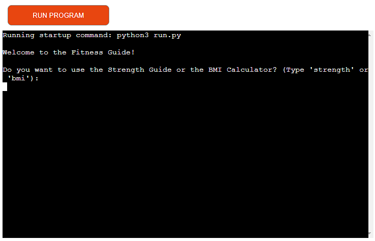
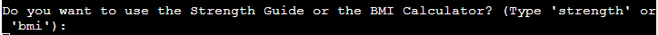
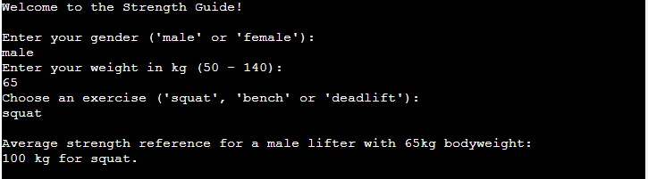
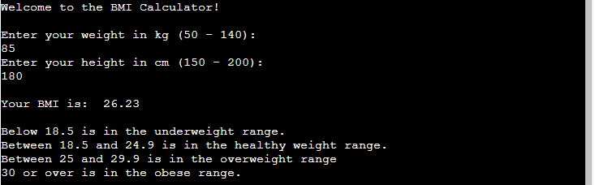
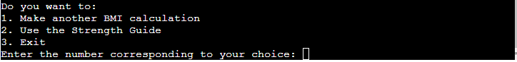

# Fitness Guide

Deployed link to the project: https://fitness-guide-pp3-15a6dec5a52f.herokuapp.com/

# Purpose of this project

The Fitness Guide is a command-line interface program, with two main features from which the user can choose from. A strength reference for 3 different exercises, or a BMI Calculator. After the user inputs the relevant information like gender, weight and height, the app displays/ calculates the requested information. The user can then choose to continue using the selected feature, change to the other feature or to exit the app.

# Table of contents:

* [User Demographic]()

* [User Experience]()
    * [User stories]()
        * [Visitor Goals]()

* [Features]()
    * [Header/Navigation]()
    * [User-Friendly Interface]()
    * [Sound effects]()
    * [Score Counter]()
    * [Game over SweetAlert]()
    * [Instructions Modal]()
    * [Collision Detection]()
    * [Future implementations]()

* [Technology]()
    * [Languages]()
    * [Frameworks, Libraries and Programs]()

 * [Wireframe]()

* [Testing]()
    * [Validator Testing]()
    * [Manual Testing]()
        * [Features Testing]()
        * [Device Testing]()
        * [Browser Compatibility]()
    * [Fixed Bugs]()

* [Deployment]()
    * [How to Deploy with Heroku]()
    * [How to Fork]()
    * [How to Clone]()

* [Credits]()
    * [Code]()

* [Acknowledgments]()

# User Demographic

The target audience for this fitness app would likely include individuals who are interested in maintaining or improving their physical health and fitness. The user demographic may include:
Fitness enthusiasts, Health-conscious individuals, people monitoring their weight etc.

# User Experience

## User stories

### User goals

- As a user, I want to easily calculate my BMI.

- As a user, I want to quickly see and understand the different ranges of the BMI.

- As a user, I want to get a strength reference tailored to me.

- As a user, I want to get strength references for different exercises compared to the average lifter.

- As a user, I want to easily switch between the Strength Guide and the BMI Calculator for comfortable navigation/use.

# Features

The app consists of one terminal with numerous features which offer the user a pleasant user experience.

## Welcome screen

Upon running the app, users are greeted with a welcome message to the Fitness Guide.

## Feature selection

Users are prompted to choose between the Strength Guide and the BMI Calculator. Input validation ensures that only valid options ('strength' or 'bmi') are accepted.

## Strength Guide

When the user selects the Strength Guide, they are prompted to enter their gender, bodyweight, and choose an exercise (bench, squat, or deadlift). Input validation is implemented for gender, weight, and exercise selection. The app provides average strength references tailored to the users gender, weight, and chosen exercise. The strength references are just an example and shouldn't be taken seriously, as they are just to show the function of the feature. After viewing the strength reference, users have the option to get another strength reference, use the BMI Calculator, or exit.

## BMI Calculator

When the user selects the BMI Calculator, they are prompted to enter their bodyweight, and height. Input validation is implemented for bodyweight, and height. The app then calculates and displays the users BMI. After viewing the BMI, users have the option to make another BMI calculation, use the Strength Guide, or exit. 

## Looping Functionality

The program is designed to loop, allowing users to make multiple calculations, get multiple strength references or to switch between the Strength Guide and the BMI Calculator without having to restart the app. 

## Reusability

Functions like the strength_guide, bmi_calculator, and calculate_bmi are modular and can be reused, promoting code maintainability.

## Future implementations

Future implementations for this app are.

- A calorie counter to calculate the daily calorie intake.

- A calorie recommendation based on the users daily activity.

# Technology

## Languages

- Python 3.12

## Frameworks, Libraries and Programs

- IDE: [Visual Studio Code](<https://code.visualstudio.com/>)
- Version Control: [Git](<https://gitforwindows.org/>)
- Repository: [GitHub](<>)
- Validator: 
- Wireframe: [LucidChart](<>)

# Wireframe

- Flowchart Wireframe

# Testing

## Validator Testing

The [ Validator]() was used to validate the project.
The validation results are displayed with a snippet of the code to indicate their association with the respective page.

## Manual Testing

### Features Testing

#### Header/Navigation

| Test Label | Test Action           | Expected Outcome | Test Outcome |
| ---------- | --------------------- | ---------------- | ------------ |
| Header     | Click on Header Title | Open Home page   | PASS         |

#### Insctructions modal

| Test Label | Test Action           | Expected Outcome | Test Outcome |
| ---------- | --------------------- | ---------------- | ------------ |
| Instructions modal| Close the modal | Game and score start running   | PASS         |

#### Score counter

| Test Label | Test Action           | Expected Outcome | Test Outcome |
| ---------- | --------------------- | ---------------- | ------------ |
| Score counter| Run game | Count up score  | PASS              |   

#### Collision detection

| Test Label | Test Action           | Expected Outcome | Test Outcome |
| ---------- | --------------------- | ---------------- | ------------ |
| Collision detection | Collide with obstacle | Game and score stop  | PASS         |

#### Game over SweetAlert

| Test Label | Test Action           | Expected Outcome | Test Outcome |
| ---------- | --------------------- | ---------------- | ------------ |
| Game over  | Collide with obstacle | Game over SweetAlert displays   | PASS         |

#### Sound effects

| Test Label | Test Action           | Expected Outcome | Test Outcome |
| ---------- | --------------------- | ---------------- | ------------ |
| Sound effects  | Jump/ Collide | Sound for jump/collision plays   | PASS         |

### Device Testing

Functionality, layout, and responsiveness were tested on the following devices and screens with issues in the collision detection:
This game was optimized for 1920px x 1080px screens.

- Lenovo Monitor 2560px x 1440px
- Samsung Monitor 1920px x 1080px
- Samsung Galaxy S9 1440px x 2960px
- iPhone 11 1792px x 828px

### Browser Compatibility

Testing has been carried out on the following browsers:
- Chrome Version 118.0.5993.117/118
- Safari Version 17.1
- Edge Version 118.0.2088.76
- Firefox Version 119.0

## Fixed Bugs

* Bug:

* Tried solutions:
1. 
2. 
3. 

* Working solution:

# Deployment

## How to Deploy with Heroku

App deployment is the process of making a program live and accessible on the internet for people to visit.

1. Log in to Heroku.
2. Click "Create new app".
3. Choose app name and select a region.
4. Click "Create app".
5. Navigate to the "Settings" tab.
6. Click "Reveal Config Vars".
7. Add Config Var in Heroku's Settings. The key is PORT and the value is 8000.
8. Scroll down to "Buildpacks".
9. Click "Add Buildpack".
10. First add "Python", click save.
11. Second add "Nodejs", click save.

## How to Fork

Forking allows you to create a copy of the original repository in your own GitHub account. This enables you to make changes to the code without affecting the original code.

1. Log into GitHub.
2. Locate repository and select the repository.
3. Select the "Fork" button near the top-right.
4. You should now have a new copy of the original repository in your own GitHub account.

## How to Clone

Cloning allows you to make an exact copy of a code repository, usually for collaboration or to work on different features independently.

1. Log into GitHub.
2. Locate repository and select the repository.
3. Click the green "<> Code" button.
4. If you want to clone using HTTPS, select the copy button in the HTTPS menu.
5. Open Git Bash.
6. Change the current working directory to the location where you want your cloned directory to be.
7. Type "git clone", and then paste the URL you copied earlier and press "Enter".

# Credits

## Code

- The code for the "DOMContentLoaded" eventlistener was learned from the walkthrough project [Love Maths](https://learn.codeinstitute.net/courses/course-v1:CodeInstitute+LM101+2021_T1/courseware/2d651bf3f23e48aeb9b9218871912b2e/234519d86b76411aa181e76a55dabe70/)

- The markdown tables were generated with the help of [Tabletomarkdown](<https://tabletomarkdown.com/convert-spreadsheet-to-markdown>)

- Code for the game idea in general were from [KnifeCircus](https://www.youtube.com/watch?v=bG2BmmYr9NQ)

- Some of the code for the obstacle movement was learned from [java2s](http://www.java2s.com/ref/javascript/javascript-setinterval-move-element.html)

- The code for the instructions modal was learned from [w3schools](https://www.w3schools.com/howto/howto_css_modals.asp)

- The code for the SweetAlert was adapted from [ChatGPT](https://chat.openai.com/)

# Acknowledgments

- Mentor support, guidance, and tips to improve my coding skills throughout the project from Brian Macharia.